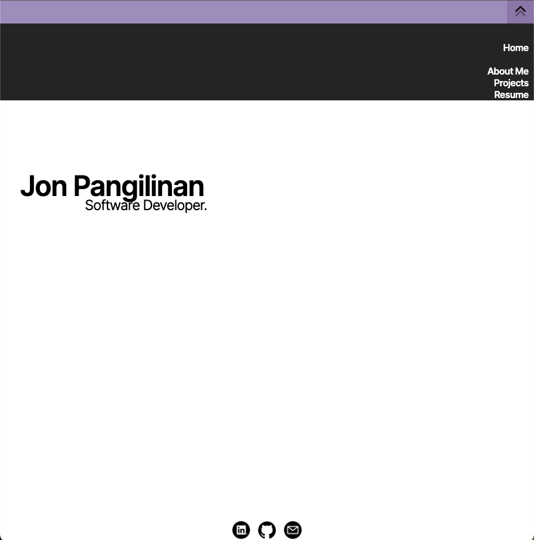

# My Portfolio Page

TEHCNOLOGIES USED:

HTML, CSS, JS

USER STORIES:

As a hiring manager, I want to see how this person designs a portfolio site and find a resume that I can download, so that I would be able to find out if this person has the skills necessary for the position I'm trying to fill

As a game developer, I would like to see the code this person has worked on, so I can see their thought process and how they went about their projects.

As a friend or family member, I'd like to see what this person is able to create, so that I can support their decision to become a software engineer.
 
 WIREFRAMES:
 
 https://www.figma.com/proto/suEylFeC0gfdXud8HuFuCq/Project-1?node-id=4%3A5&scaling=scale-down&page-id=4%3A2

https://www.figma.com/proto/suEylFeC0gfdXud8HuFuCq/Project-1?node-id=4%3A15&scaling=scale-down&page-id=4%3A3

UNSOLVED PROBLEMS:

-had to change the way the images moved when navigating between projects
-while building mobile first, navigation from the top of the screen seemed like a better choice
-only unavailable link is the download resume button because I'm using a sample resume and nobody wants a copy of that

